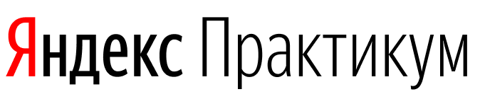
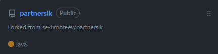
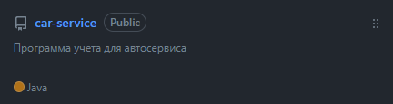
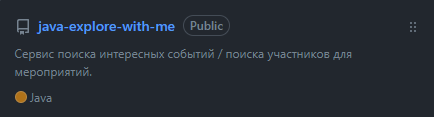
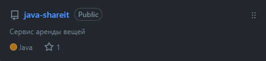
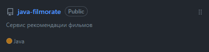

<h1 align="center"> Привет всем, я <a href="https://github.com/AlexeyVlz" target="_blank">Алексей</a>! 👋 <h3 align="center">  
    ===========================================

<h3 align="center"> Программирую на  </h3 align="center">

---------------------------------------------------------

Закончил  по направлению Java-разработчик

В НАСТОЯЩЕЕ ВРЕМЯ:  
- участвую в проекте по разработке личного кабинета для клиентов оптовой компании:  
  
В качестве СУБД используем 
, для контейнеризации 
, для взаимодействия с БД  Hibernate, JPQL, Predicate   
 
  
- занимаюсь пет проетом:   
    
   REST API, Spring Boot, PostgreSQL, Hibernate, Docker, SQL, JPQL, Maven, lombok, h2, Mockito, JUnit 

-----------------------------------

ВЫПОЛНЕННЫЕ ПРОЕКТЫ:  

- Сервис поиска событий.  Микросервисная архетиктура   
  
   Spring Boot, Docker, JUnit, PostgreSQL, Hibernate, SQL, JPQL, Maven, REST, lombok, h2, Mockito, Criteria   

- Сервис аренды вещей.  Микросервисная архетиктура   
    
  В качестве СУБД использовал 
  , для контейнеризации 
  , для взаимодействия с БД  Hibernate, JPQL ,  
  тестирование:  JUnit 5, DataJpaTest 

- Сервис рекомендации фильмов  
    
    Работа с БД через JdbcTemplate  